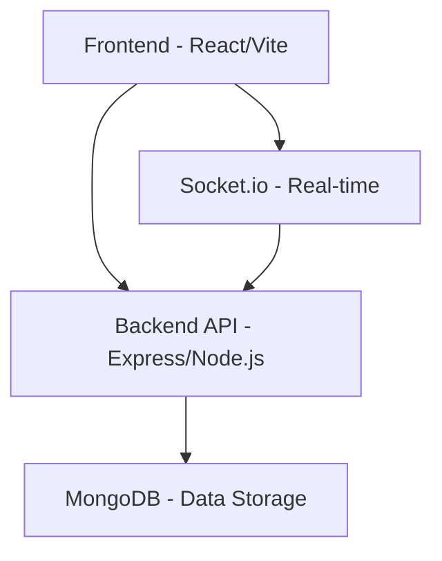

# Collaborative Task Management Platform

A real-time collaborative task management application built with React, Node.js, Express, TypeScript, and MongoDB.

## Project Structure

- `backend/` - Node.js/Express backend API
- `frontend/` - React/Vite frontend application

## Tech Stack

### Frontend
- React (Vite)
- TypeScript
- Tailwind CSS
- React Query (TanStack Query)
- React Hook Form + Zod
- Socket.io-client

### Backend
- Node.js
- Express.js
- TypeScript
- MongoDB (Mongoose)
- Socket.io
- JWT + bcrypt for authentication
- Zod for validation

### Database
- MongoDB Atlas

## Features
- User authentication and authorization
- Task CRUD operations
- Real-time updates with Socket.io
- Assignment notifications
- Dashboard with filters and sorting

## Getting Started

### Prerequisites
- Node.js (v14 or higher)
- MongoDB Atlas account or local MongoDB instance

### Installation

1. Clone the repository
2. Install root dependencies:
   ```
   npm install
   ```

### Running the Application

You can run both frontend and backend simultaneously or separately:

#### Run Both Servers
```bash
npm run dev
```

#### Run Backend Only
```bash
npm run dev:backend
```

#### Run Frontend Only
```bash
npm run dev:frontend
```

### Backend Setup

1. Navigate to the backend directory:
   ```
   cd backend
   ```

2. Install dependencies:
   ```
   npm install
   ```

3. Create a `.env` file with your MongoDB connection string and other environment variables

4. Start the development server:
   ```
   npm run dev
   ```

### Frontend Setup

1. Navigate to the frontend directory:
   ```
   cd frontend
   ```

2. Install dependencies:
   ```
   npm install
   ```

3. Create a `.env` file with your API and Socket URLs

4. Start the development server:
   ```
   npm run dev
   ```

## Architecture



## API Documentation

See `frontend/README.md` for detailed API endpoints.

## Testing

Both frontend and backend have basic test setups. You can run tests with:

### Backend Tests
```bash
cd backend
npm test
```

### Frontend Tests
```bash
cd frontend
npm test
```

## Deployment

### Backend
Deploy to platforms like Render or Railway.

### Frontend
Deploy to platforms like Vercel.

### Database
Use MongoDB Atlas for production database hosting.

## License
MIT