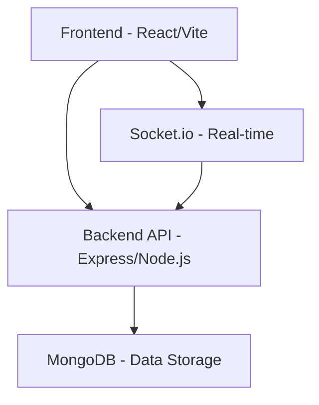

# Task Management System

A collaborative task management platform with real-time updates, built with React, Node.js, Express, TypeScript, and MongoDB.

## Tech Stack

### Frontend
- **Framework**: React (Vite)
- **Language**: TypeScript
- **Styling**: Tailwind CSS
- **State Management**: React Query (TanStack Query)
- **Forms**: React Hook Form + Zod
- **Routing**: React Router v6
- **Real-time**: Socket.io-client

### Backend
- **Runtime**: Node.js
- **Framework**: Express.js
- **Language**: TypeScript
- **Database**: MongoDB with Mongoose
- **Authentication**: JWT + bcrypt
- **Validation**: Zod
- **Real-time**: Socket.io
- **Testing**: Jest

## Architecture



## Features

1. **User Authentication**
   - User registration and login
   - JWT-based authentication with HttpOnly cookies
   - Protected routes

2. **Task Management**
   - Create, read, update, and delete tasks
   - Task filtering and sorting
   - Task assignment to other users
   - Due dates and priorities

3. **Real-time Collaboration**
   - Live task updates
   - Assignment notifications
   - WebSocket-based communication

4. **Dashboard**
   - View assigned tasks
   - View created tasks
   - View overdue tasks
   - Filter and sort tasks

## API Endpoints

### Authentication
- `POST /api/users/register` - Register a new user
- `POST /api/users/login` - Login user
- `GET /api/users/profile` - Get user profile
- `PUT /api/users/profile` - Update user profile

### Tasks
- `POST /api/tasks` - Create a new task
- `GET /api/tasks` - Get all tasks
- `GET /api/tasks/:id` - Get a specific task
- `PUT /api/tasks/:id` - Update a task
- `DELETE /api/tasks/:id` - Delete a task
- `GET /api/tasks/overdue` - Get overdue tasks

### Notifications
- `GET /api/notifications` - Get user notifications
- `POST /api/notifications/:id/mark-read` - Mark notification as read
- `POST /api/notifications/mark-all-read` - Mark all notifications as read

## Setup Instructions

### Backend Setup

1. Navigate to the backend directory:
   ```
   cd backend
   ```

2. Install dependencies:
   ```
   npm install
   ```

3. Create a `.env` file with the following variables:
   ```
   MONGODB_URI=your_mongodb_connection_string
   JWT_SECRET=your_jwt_secret
   PORT=5000
   FRONTEND_URL=http://localhost:5173
   ```

4. Start the development server:
   ```
   npm run dev
   ```

### Frontend Setup

1. Navigate to the frontend directory:
   ```
   cd frontend
   ```

2. Install dependencies:
   ```
   npm install
   ```

3. Create a `.env` file with the following variables:
   ```
   VITE_API_URL=http://localhost:5000
   VITE_SOCKET_URL=http://localhost:5000
   ```

4. Start the development server:
   ```
   npm run dev
   ```

## Deployment

### Backend
Deploy to platforms like Render or Railway.

### Frontend
Deploy to platforms like Vercel.

### Database
Use MongoDB Atlas for production database hosting.

## License
MIT